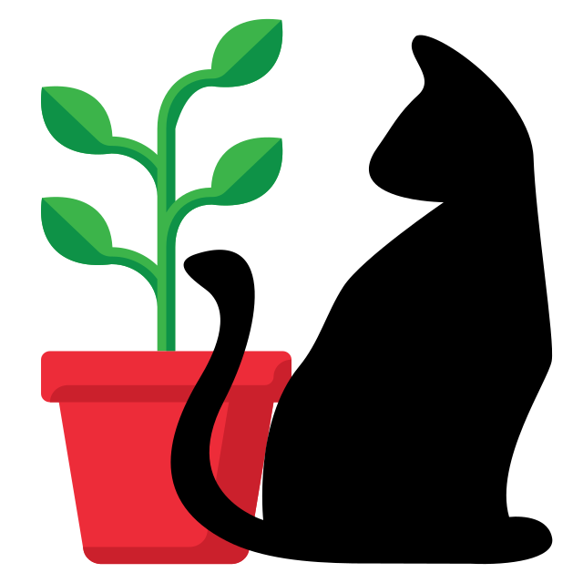
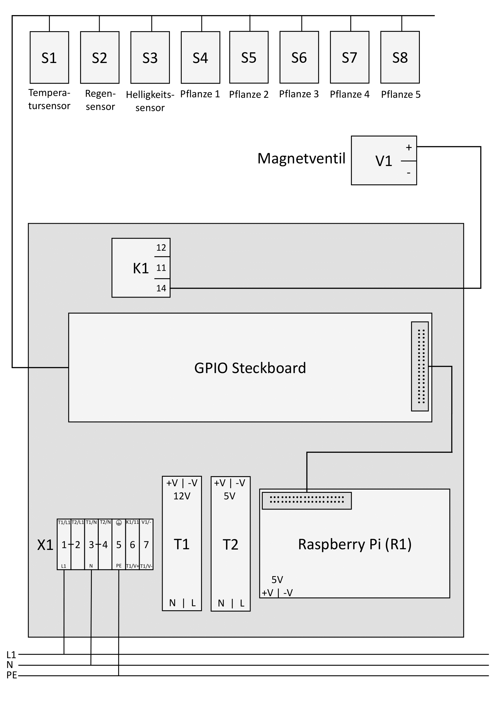
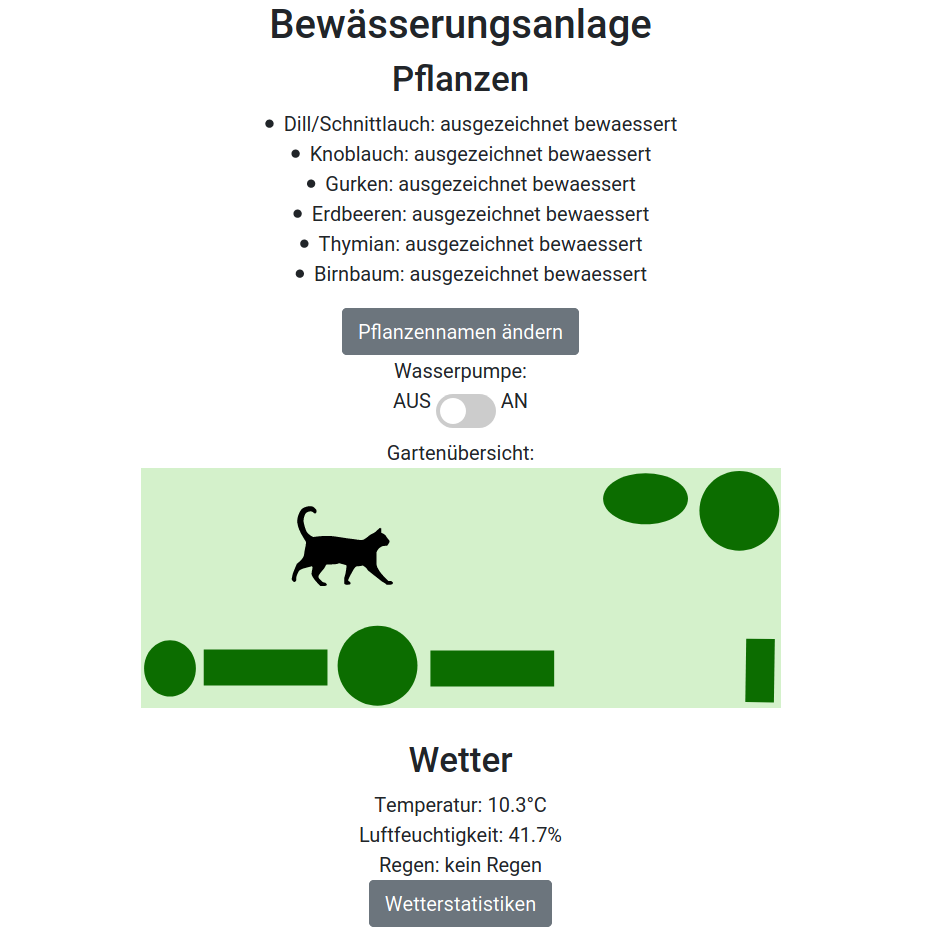

# Bewässerungsanlage

- Bewässerungsanlage zum automatischen Bewässern von Gartenpflanzen
- Inklusive Regen-, Bodenfeuchtigkeits-, Helligkeits-, Temperatur- und Luftfeuchtigkeitssensor
- Anhand vergangen, aktuellen und zukünftigen Wetterdaten wird entschieden, ob bewässert wird
- Sensordaten in Android App und Webbrowser einsehbar
- Pumpe auch manuell per App steuerbar

Alte Version:
- Anhand der Sensordaten wird entschieden, ob bewässert wird

## Hardware

- Raspberry zur Steuerung der Anlage und Bereitstellung des Servers
- Steckboard zum Anbinden der Sensoren und Aktoren an den Raspberry
- Magnetventile zum Steuern der Wasserkreisläufe
- Netzteil (230V AC -> 5V DC) zur Versorgung des Raspberrys
- Netzteil (230V AC -> 12V DC) zur Versorgung des Magnetventils
- 5V Steuerrelais zum Öffnen der Magnetventile mit dem Raspberry
- <a href="https://www.amazon.de/gp/product/B072MZJ92F/ref=ppx_yo_dt_b_asin_title_o07_s00?ie=UTF8&psc=1">Schlauchsystem</a>
- alle oben genannten Sensoren

## Server

Server läuft über Python mit der Flask-Library auf dem Raspberry Pi. Startet beim booten automatisch und ist im Heimnetzwerk unter https://RASPBERRY_IP:5000 im Webbrowser aufrufbar. Dort gelangt man wie im Bild zu sehen zu einer Übersichtsseite, die alle wichtigen Informationen zusammenfasst. Außerdem lassen sich die Pflanzennamen ändern und man kann sich einen <a href="https://i.ibb.co/Yd1D0bS/Bildschirmfoto-von-2020-04-15-12-23-20.png">zeitlichen Verlauf der Wetterstatistiken</a> anzeigen lassen.

## Android App

Die Android App wurde mit Java in Android Studio programmiert und dient der bequemen Ansicht und Steuerung der Anlage über das Smartphone. Im Bild ist eine Draufsicht des Gartens verfügbar, bei dem der aktuelle Status der Bodenfeuchtigkeit der Pflanzen angezeigt wird (Grün = ausgezeichnet bewässert, gelb = ausreichend bewässert, rot = braucht Wasser, grau = mit keinem Sensor überwacht).
Klickt man auf Wetterdaten öffnet eine neue Seite, auf der der Temperaturverlauf der letzten Stunden betrachtet werden kann.

Per Klick auf "Essensideen" gelangt man außerdem zu einem weiteren Feature der App, einer Datenbank an Essensrezepten. Hier kann man verschieden Rezepte betrachten, verändern und neue hinzufügen. Diese werden ebenfalls auf dem Server gespeichert, sodass sie für alle Nutzer des Heimnetzwerks verfügbar sind. Außerdem kann ein zufälliges Rezept angezeigt werden lassen.